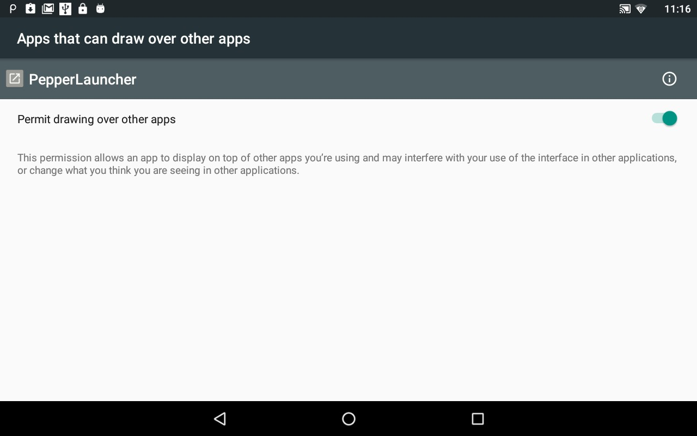
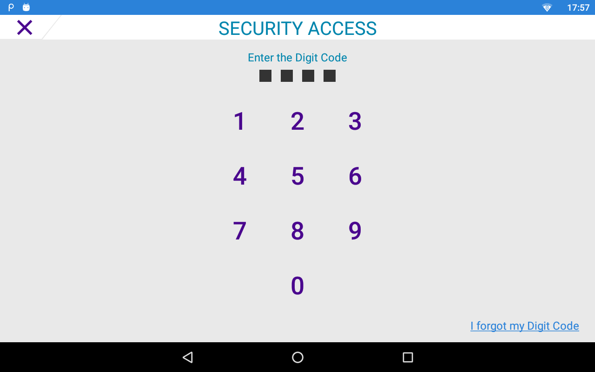
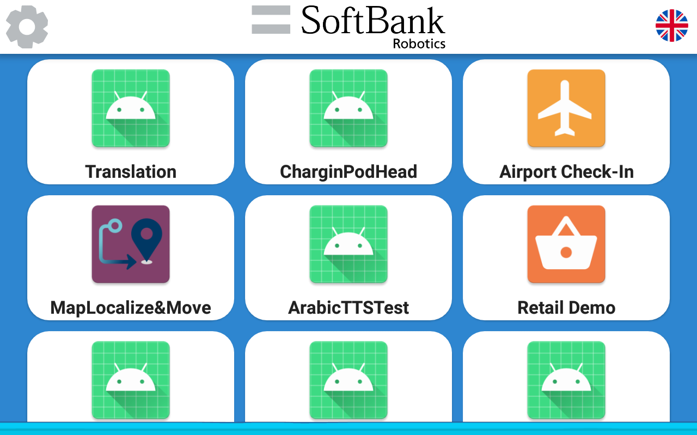

# Pepper Application Launcher

Article and code updated on 20/05/21

This is a launcher that will find all the robotified apps (which manifest contains "com.softbank.hardware.pepper"), excluding itself. You can also add apps to the launcher manually, the procedure to do so is described in the MainActivity (getPepperAppList method). Applications can be launched using buttons on the tablet, or the voice, interacting with Pepper in any of the languages provided.

To access the Android settings you will need to install Access Manager, which is an application that able to protect an application area with a digit code. Therefore, you will need to install this application and set a digit code. This digit code will be the one to use to access the settings in the AppLauncher. See documentation [here](https://command-center.softbankrobotics.com/store/#/mission/11740)

## Compatibility

The app requires the permission to draw over other apps and will ask for when it starts, if it doesn't have it already.

If you encounter crashes, make sure that the permission is granted (restarting the app should fix the issue).

<p align="center">

</p>

## Integration

The demo application supports French and English. If you want to add your own language, you must follow these steps :

1. Make sure the language is available and installed on Pepper

2. In this application, topics are built at runtime, using string file. To do so, you need to create a string file in the language of your choice (right click on res -> new -> Android Resource File -> File Name : strings & Resource Type : Values and in Available quialifiers -> locale -> Choose your language and select Any Region. Click OK). 
Finally fill the new strings.xml file with a translation of the default one (folowing the same structure, especially for the topic with "topic/concept/hello/voice/start", these strings need to have the same syntax as a topic, an error in the syntax will cause a crash of the application). Note : Don't forget to escape quotes in the strings.xml file

3. Add the language tag in the list named locales
```
    private final List<String> locales= Arrays.asList("fr","en"); //ADD YOUR LANGUAGE HERE
```

4. Adapt the layout with the information (flag) of the language, and the configureButtonLanguage function (needed to update the language layout when switching language).


## Screenshots

<p align="center">


</p>
